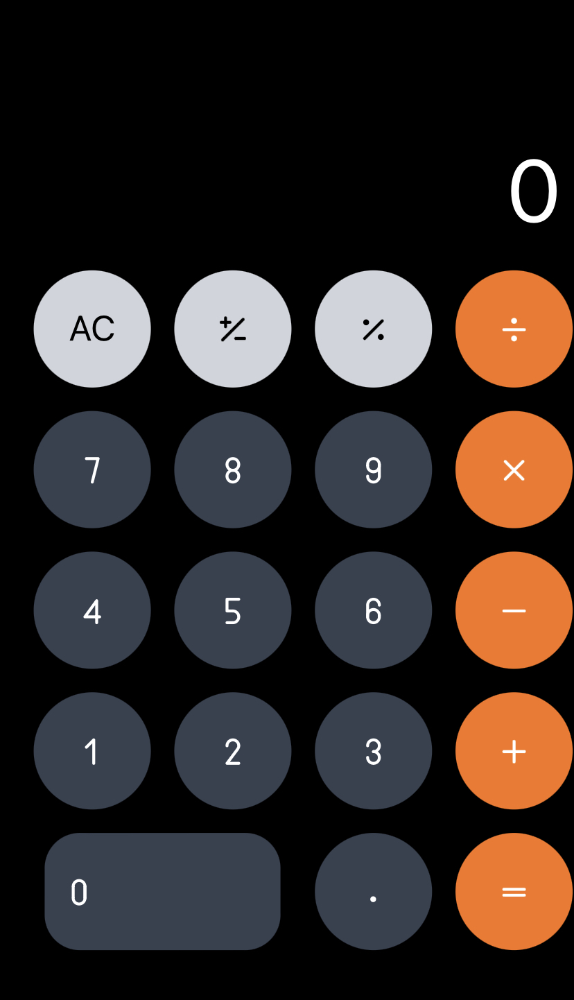

## Overview

このプロジェクトは Next.js Typescriptの練習用です。
便利系のツールの開発をしながら、ディレクトリ構成やテストの書き方などを学習していきます。

[](https://opensource.org/licenses/MIT)


## Getting Started

このセクションでは、プロジェクトの要件と開発環境の設定方法を説明します。

## Installation

1. リポジトリをクローンするかダウンロードしてください。

```
git clone https://github.com/kawabata324/ts-plactice.git
```

2. 必要なライブラリやモジュールをインストールしてください。

```
yarn install
```

## Usage

プロジェクトの使用方法について説明します。コードの詳細な例と実行方法を提供してください。


開発環境の立ち上げ
```
yarn dev
```

単体テストの実行
```
yarn test
```

storybookの立ち上げ
```
yarn storybook
```

## Screenshots

URL: https://ts-plactice-pebz.vercel.app/calculator




## Contact

質問やバグレポートについては、以下の方法でお問い合わせください。

- GitHub Issues: https://github.com/kawabata324/ts-plactice/issues
- Twitter: https://twitter.com/haru1125632
